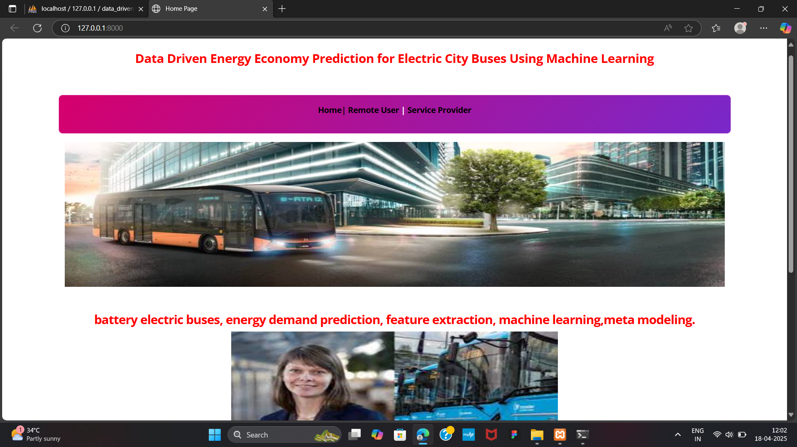
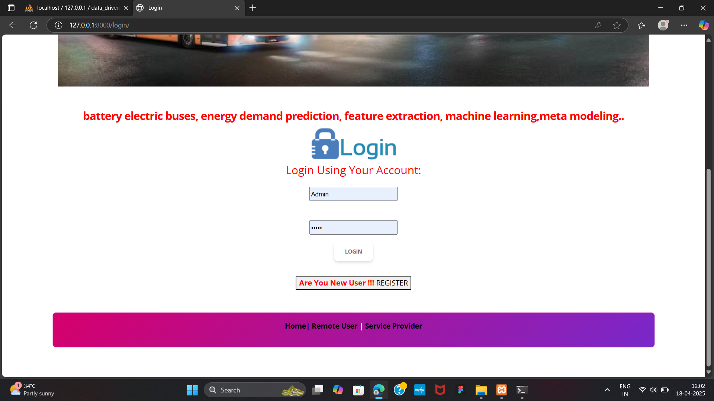
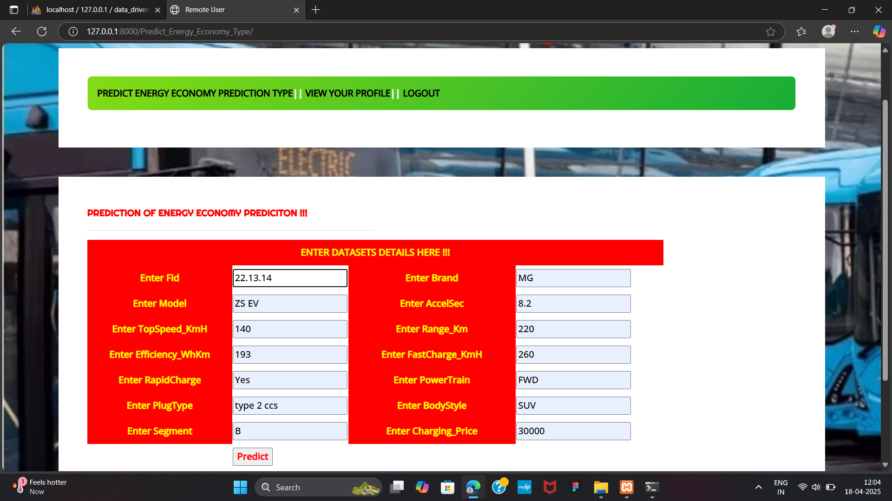
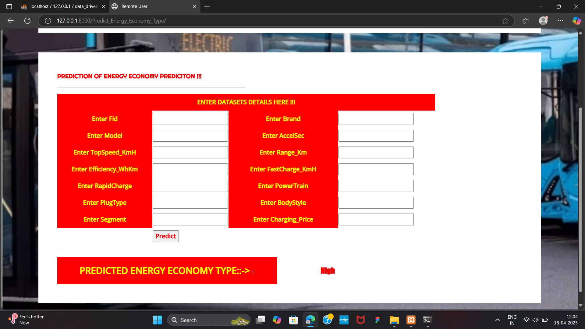

  

# ⚡ Data-Driven Energy Economy Prediction for Electric City Buses 🚍

A machine learning-based web application to predict energy consumption of electric city buses, inspired by research-driven methodologies to enhance sustainability and route planning in smart cities.

## 📌 Features

- Predicts energy economy based on input parameters
- Clean web interface for input/output and visual insights
- Research-backed ML models integrated into a Django web framework
- Real-time prediction with model accuracy comparison

## OUTPUT SCREENS

  
  

   

  
  

## 🛠️ Tech Stack

  
  

  
  
  

  
  

  
  
  

